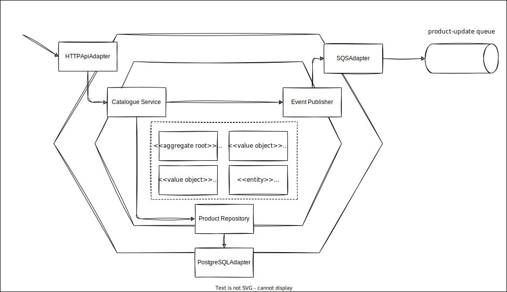

# Catalogue microservice for an order system

## Features

- Create product
- Get product by SKU
- Update product
- Delete product

## Software Architecture

This microservice is built upon the hexagonal architecture and aggregate development pattern.



## Solution Architecture

- AWS SQS
- PostgreSQL (RDS)

## Tools

- Terraform (IaC)
- Github Actions

## Requirements

- Docker
- Docker Compose
- Python 3.11

## Frameworks

- FastApi
- SQLAlchemy + Alembic(migrations)

## Tests

- **Run tests**:

```sh
make test-catalogue
```

## Development

1. **Init Database (with migrations)**:

```sh
make init-postgres
```

2. **Init Local stack(AWS Mock)**:

```sh
make init-localstack
```

3. **Init Catalogue service**:

```sh
make init-catalogue
```

- **Create catalogue migrations**:

```sh
make create-catalogue-migration
```

- **Apply catalogue migrations**:

```sh
make apply-catalogue-migrations
```
